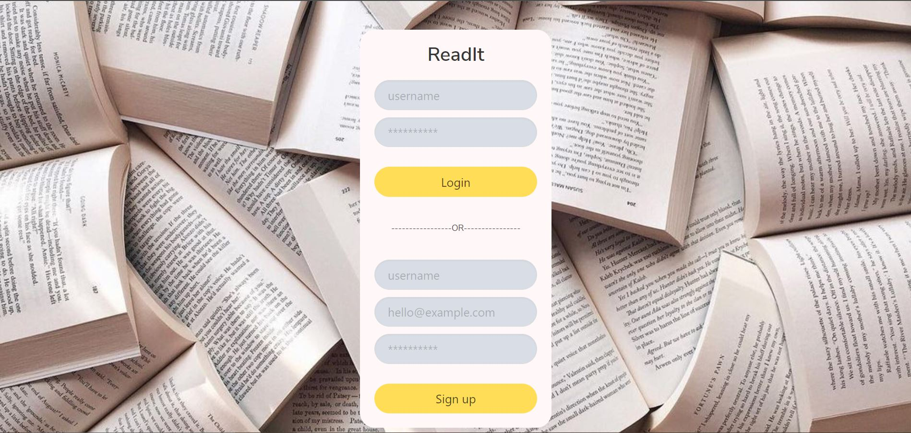
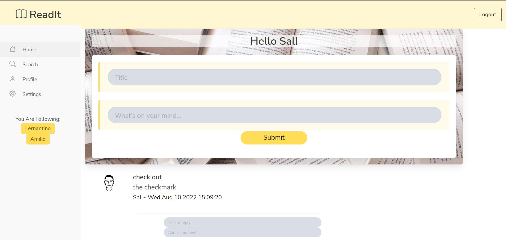
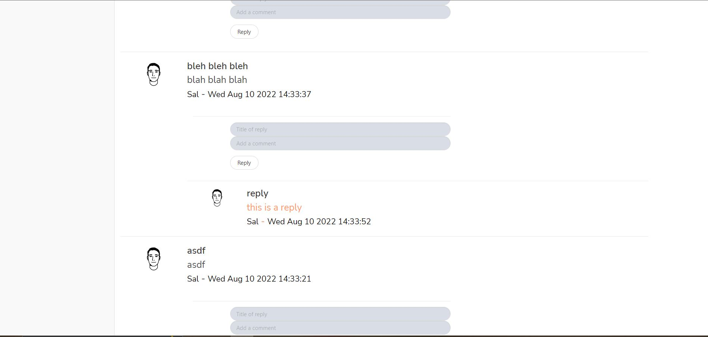
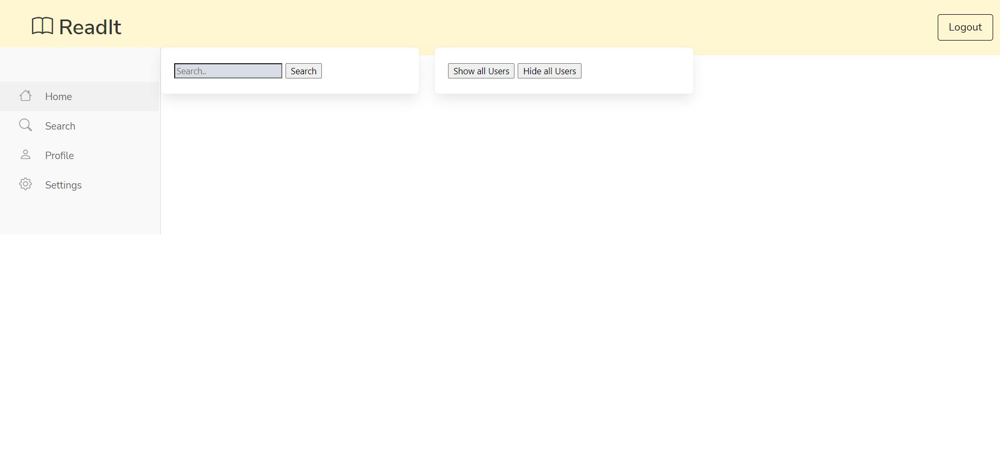
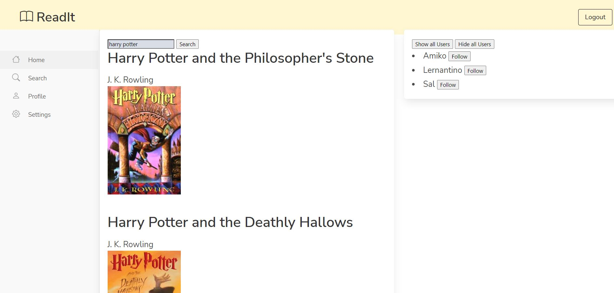

# Group-Project-2-ReadIt

## Description

Our group developed an app dedicated to book lovers to connect with one another and search for books that they want to read. In further future development, the user will be able to add searched books to lists and keep personal notes.

### Note

The Profile and Setting pages of ReadIt have not yet been completed and are part of future development.

### User Story

As a book enthusiast,
I want a website that allows me to keep track of books, notes, and connect with others,
so that I can be more involved and organized with my reading.

## Table of Contents

- [Description](#description)
- [Technologies](#technologies)
- [Local Installation](#local-installation)
- [Deployed Application](#deployed-application)
- [Usage](#usage)
- [Future Development](#future-development)
- [Contributors](#contributors)

## Technologies

Technologies used for website:

* Javascript
* jQuery
* handlebars.js
* MySQL
* Sequelize
* Express.js
* bcrypt
* animejs
* Bulma Framework

## Local Installation

Steps for running the website locally in a terminal:

* Make sure npm is installed in the project folder: `npm i`
* Create .env file based off example
* Run `source schema.sql` in Mysql
* Run `node seeds/seed.js`
* Run `node server.js`
* Open in `localhost:3001` to view site

## Deployed Application

The application is deployed through Heroku and can be accessed using the following link:
[ReadIt](https://stormy-chamber-61658.herokuapp.com/)

## Usage

### Login and account creation
When an unique account is created, you must then login using the normal login form.

### Top of Homepage

### Posts with replies on Homepage

### Search page landing

### Search page with shown users and book results

## Future Development

* Spice up CSS
* Ability to delete/edit posts and replies
* Avatar/Picture option (Profile)
* Build Profile and Settings pages
* Messages to User (password incorrect, not long enough, etc.)
* Be able to save books from search to lists
* More anime.js animations!
* Incorpoate map API to look for bookstores and such close by
* Open calendar for book events
* More advanced search system (search by genre, author, etc.)
* Add recently viewed (books that you have looked at)
* Create recommendations/reviews by users
* Recommended for you
* Dark mode/Light mode
* Amazon API
* Incorporate a logo!
* Remove ability to duplicate user following (can follow someone more than once…)
* Proper time zones (post and reply time is currently set to only one time zone)

## Contributors

Avyrie Fellows, Ciara Gauntt, Isaac Harris, Colton Higley, Kami Pacanos, Robin Tarasevich

** animejs submit button used for post submission was created by Andrew Millen - https://codepen.io/andrewmillen 

